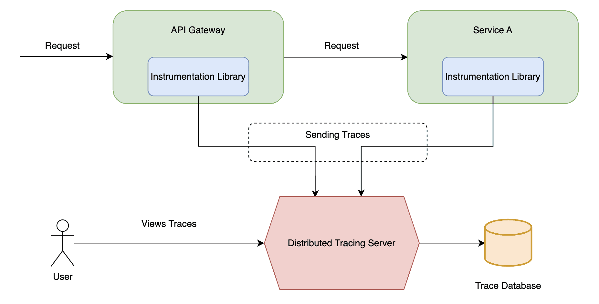

# kong-zipkin
Zipkin is a solution made of:
- a central server able to collect traces from client applications
- instrumentation libraries used by client apps to send traces to the Zipkin server

Zipkin supports the [Opentelemetry](https://opentelemetry.io/docs/) standard. In particular it supports the [W3C propagation](https://www.w3.org/TR/trace-context/#traceparent-header) through header `traceparent`.  
With Zipkin, each monitored application is publishing spans.  
A span has:
- a name
- an id
- a start date
- an end date
- an optional parent id
- optional attributes

A trace is a set of spans triggered by the same event.
## build and deploy
```
podman build -t kong:kong-zipkin .
podman build -t dummy-back-end:latest dummy-back-end/
podman network create foo
podman play kube pods.yml --net foo
podman play kube pods.yml --down
```
## architecture

